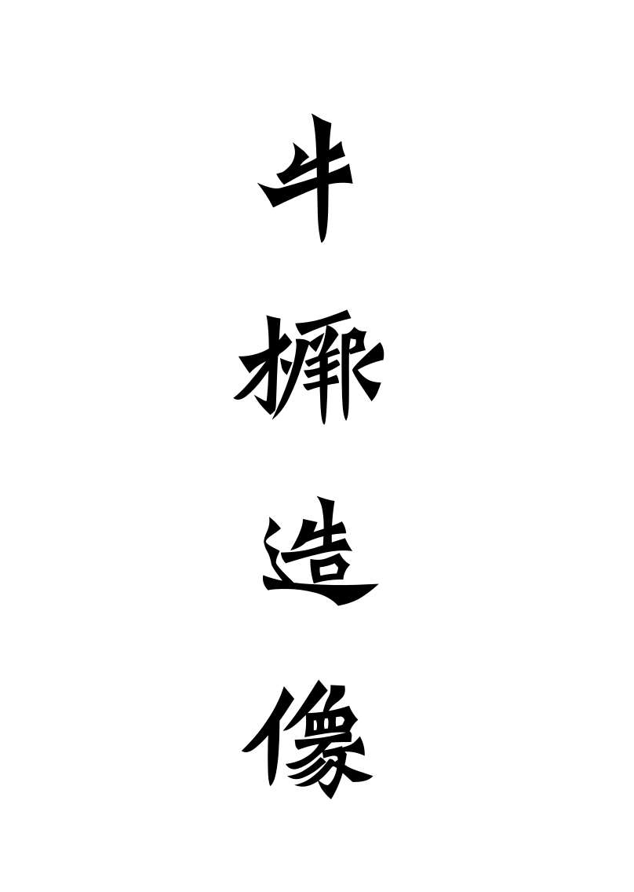

# ngiugyat

《牛橛造像記》，全稱《太和十九年十一月長樂王丘穆陵亮夫人尉遲為亡息牛橛造彌勒像記》，《龍門二十品》之一。高 100 公分，寬 34 公分，是長樂王丘穆陵亮夫人尉遲氏（後改「尉」姓）為亡去的兒子牛橛所造，過去曾有「牛橛龕」之稱。碑文字型端莊整肅。

此項目將《牛橛造像記》透過 Inkscape 軟體進行矢量化操作，并用 FontCreator 14.0 軟體生成字型。計劃輾壓（甚麽鬼啦）欣喜堂的拙劣拼字……因時間不充裕，只在有需要的時候臨時加字，歡迎協助補字。

預覽圖象：

